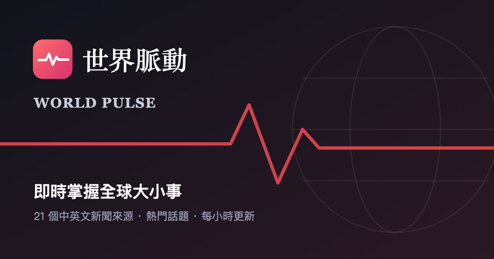

# 世界脈動 World Pulse

即時掌握全球大小事。彙整 21 個中英文新聞來源，每小時自動更新，可依分類、地區、原文語言瀏覽全球新聞，並追蹤 Google 搜尋趨勢與多家媒體共同報導的熱門話題。

純靜態網站：只用 HTML、CSS、JavaScript，不需要安裝任何套件、不需要建置、沒有後端伺服器。新聞由 GitHub Actions 每小時抓取，透過 GitHub Pages 發布。



---

## 功能一覽

### 閱讀新聞
- **報紙式首頁**：頂端是頭條區（1 則大頭條、2 則次要新聞、最新快訊），下方依分類分段，每段 4 則，可點「看更多」
- **兩種排列方式**：卡片、條列，可隨時切換
- **新聞內頁**：點新聞會跳出彈出視窗，顯示大圖、摘要與「閱讀原文」按鈕（另開分頁）
- **新聞保持原文**：中文新聞顯示中文、英文新聞顯示英文；原文和介面語言不同時，提供「用 Google 翻譯原文」按鈕
- **重複轉載合併**：不同媒體刊出一字不差的同一則新聞時，只顯示一則，並標示「另有 N 家媒體報導」

### 篩選與搜尋
- **分類**：國際、財經、科技、科學環境、健康、體育、文化娛樂
- **地區**：亞洲、歐洲、美洲、非洲、中東、大洋洲
- **原文語言**：中文、English
- **關鍵字搜尋**：即時篩選標題、摘要與媒體名稱
- 每個篩選按鈕上的數字，會隨其他條件即時變動

### 熱門話題
- **搜尋趨勢**：Google 台灣、美國的熱門搜尋，附搜尋量與相關報導；沒有報導的話題可直接到 Google 新聞搜尋
- **媒體焦點**：自動找出 48 小時內被多家媒體報導的同一事件
- **排序**：「最熱」（依搜尋量／報導媒體數）或「最新」

### 貼心設計
- **即時跑馬燈**：報頭下方輪播最新 12 則標題
- **已讀標記**：看過的新聞標題會變淡
- **新文章提示**：再次來訪時顯示「自上次來訪後新增 N 則」，可一鍵只看新的
- **分享**：每則新聞都有自己的分享連結，在 LINE、Facebook 會顯示該則新聞的預覽卡片
- **中英雙語介面**：右上角「中／EN」切換，只換介面文字，不影響新聞內容
- **6 種配色**：自動（預設）、暖白、白色、深藍、經典黑、深色。「自動」會依裝置設定，在暖白與深色之間切換
- **各種狀況都有提示**：載入中、網路斷線、載入失敗、找不到結果、資料超過 3 小時沒更新，都有清楚的說明與「重新載入」按鈕
- **手機友善**：版面自動適應手機寬度

---

## 新聞來源

| 語言 | 來源 |
|---|---|
| 中文（6 個） | BBC 中文、法廣 RFI、德國之聲 DW、紐約時報中文網、中央社、自由時報 |
| 英文（15 個） | BBC（國際、7 個地區、6 個分類）、The Guardian |
| 熱門搜尋 | Google 搜尋趨勢（台灣、美國） |

新聞內容版權屬於各原始媒體。本站只透過各媒體公開的 RSS 顯示標題與摘要，並連回原網站。

---

## 資料夾結構

```
world-pulse/
├── index.html                    首頁（網站唯一的頁面）
├── README.md                     本說明文件
├── .github/
│   └── workflows/
│       └── update-news.yml       GitHub Actions：每小時抓新聞並發布網站
├── css/
│   └── style.css                 所有樣式，包含 5 組配色
├── js/
│   ├── feeds.js                  設定檔：新聞來源、介面文字、分類關鍵字
│   └── app.js                    主程式
├── images/
│   ├── logo.svg                  網站標誌
│   ├── favicon.svg               瀏覽器分頁小圖示
│   ├── placeholder.svg           新聞圖片載入失敗時的備用圖
│   └── og-cover.jpg              分享到 LINE／Facebook 時的預覽封面
└── scripts/
    └── fetch_news.py             抓取新聞的程式（GitHub Actions 自動執行）
```

以下兩個資料夾**不在 repo 裡**，由 GitHub Actions 每次發布時自動產生：

| 自動產生 | 內容 |
|---|---|
| `data/news.json` | 所有新聞與搜尋趨勢資料 |
| `s/xxxx.html` | 每則新聞的分享頁（給 LINE、Facebook 讀取預覽卡片用） |

---

## 運作方式

```
每小時（或你上傳檔案時）
        │
        ▼
GitHub Actions 執行 scripts/fetch_news.py
  ├─ 讀取 js/feeds.js 裡的新聞來源清單
  ├─ 下載 21 個 RSS ＋ Google 搜尋趨勢
  ├─ 存成 data/news.json
  └─ 替每則新聞產生分享頁 s/xxxx.html
        │
        ▼
發布到 GitHub Pages
        │
        ▼
讀者打開網站 → 讀取 data/news.json → 分類、排序、顯示
```

- 抓新聞的工作在 GitHub 那邊完成，讀者的瀏覽器只讀一個 JSON 檔，所以速度快，也不會被新聞網站擋。
- 如果讀不到 `data/news.json`（例如在自己電腦直接打開 `index.html`），網站會改用免費的跨網域代理服務直接抓 RSS。這只是備援：代理服務常常限流，可能只抓得到部分新聞。

---

## 第一次發布到 GitHub

1. **建立 repo**：在 GitHub 建一個新的 repository（公開）。
2. **上傳檔案**：點 **Add file → Upload files**，把 `index.html`、`README.md`，以及 `css`、`js`、`images`、`scripts` 四個資料夾拖進去，按 **Commit changes**。
3. **建立自動化設定檔**：Mac 預設會隱藏 `.github` 這種點開頭的資料夾，拖曳上傳時常會漏掉，所以請手動建立：
   - 點 **Add file → Create new file**
   - 檔名欄輸入 `.github/workflows/update-news.yml`（打到 `/` 時會自動變成資料夾）
   - 把本機 `update-news.yml` 的內容整個貼上，按 **Commit changes**
4. **開啟 GitHub Pages**：到 **Settings → Pages → Build and deployment → Source**，選 **GitHub Actions**。
5. **第一次執行**：到 **Actions** 分頁，點左側「更新新聞並發布網站」，按 **Run workflow**。大約 1 分鐘後完成，網址會顯示在執行結果裡（通常是 `https://你的帳號.github.io/repo名稱/`）。

之後每小時會自動更新，你上傳或修改檔案時也會自動重新發布。

> 預設分支必須是 `main`。如果你的 repo 預設分支叫別的名字，請把 `update-news.yml` 裡的 `branches: [main]` 改成你的分支名稱。

---

## 日常更新網站

修改檔案後，到 GitHub 上用 **Add file → Upload files** 覆蓋上傳即可，約 1 分鐘後自動生效。

`.github/workflows/update-news.yml` 若有修改，因為上傳時常會漏掉隱藏資料夾，請到 GitHub 上打開這個檔案，按鉛筆圖示編輯，貼上新內容。

---

## 自己動手調整

大部分調整只需要改 **`js/feeds.js`**，不用動主程式。

### 新增或移除新聞來源
在 `FEEDS` 清單裡，照現有格式加一行或刪一行：

```js
{ lang: 'zh', source: '媒體名稱', url: 'https://example.com/rss.xml' },
```

| 欄位 | 說明 |
|---|---|
| `lang` | 新聞原文語言，`'zh'` 或 `'en'` |
| `source` | 卡片上顯示的媒體名稱 |
| `url` | RSS 網址 |
| `cat` | （選填）固定的分類，例如 `'tech'`；沒填就用關鍵字自動判斷 |
| `region` | （選填）固定的地區，例如 `'asia'`；沒填就用關鍵字自動判斷 |

> **每個來源請寫在同一行**：GitHub 的抓取程式是一行一行讀這份清單的。

### 新增搜尋趨勢的國家
在 `TRENDS` 加一行（例如日本），並在 `I18N` 的 `geo` 裡加上中英文顯示名稱：

```js
jp: 'https://trends.google.com/trending/rss?geo=JP'
```

### 修改介面文字
`I18N` 裡分成 `zh`（中文）與 `en`（英文）兩組，直接改引號裡的文字即可。

### 調整自動分類
沒有指定分類／地區的新聞，會用標題和摘要裡的關鍵字判斷。如果某類新聞常被分錯，可以到 `KEYWORDS` 增減關鍵字：
- 中文關鍵字請同時放繁體與簡體（德國之聲是簡體）
- 全大寫的英文（例如 `US`、`AI`）會區分大小寫，避免誤判一般單字

### 修改配色
配色在 `css/style.css` 最上方，每組配色是一組顏色變數（`[data-theme="paper"]` 等）。若要改選單裡色塊預覽的顏色，也要同步修改 `js/app.js` 裡的 `THEMES`。

### 更換預覽封面
直接用同名檔案取代 `images/og-cover.jpg`。建議尺寸 1200 × 630 像素，JPG 格式。

---

## 在自己電腦預覽

**最簡單的方式：** 直接用瀏覽器打開 `index.html`。網站會改用免費代理抓新聞，可能只看得到部分新聞，熱門話題也可能顯示「暫時無法取得」，這是正常的。

**完整預覽（需要電腦有 Python 3，Mac 通常內建）：** 在終端機進入 `world-pulse` 資料夾，依序執行：

```bash
python3 scripts/fetch_news.py
```

```bash
python3 -m http.server 8000
```

然後用瀏覽器打開 `http://localhost:8000`。

> 第一個指令會在你的電腦產生 `data/` 和 `s/` 資料夾，只是預覽用，**不需要上傳**。GitHub 發布時會自動重新產生。

---

## 注意事項

- **排程可能自動暫停**：repo 連續 60 天沒有任何更動時，GitHub 會自動暫停每小時的排程，並寄信通知你。網站頁面會顯示「新聞已經 N 小時沒有更新」的提醒。到 **Actions** 分頁點 **Enable workflow** 即可恢復。
- **RSS 來源可能變動**：媒體偶爾會更改或停用 RSS 網址。某個來源抓不到時，網站狀態列會顯示「N 個來源暫時無法載入」，可到 Actions 的執行紀錄查看是哪個來源失敗。
- **新聞保留數量**：每個來源只保留最新 30 則。較舊的新聞分享連結點開後，會顯示「找不到這則新聞」並停在首頁。
- **LINE 預覽快取**：LINE 會暫存預覽卡片，網址或封面更新後，可能要幾天才會看到新的預覽。
- **版權**：新聞內容版權屬於各原始媒體。若要將網站用於商業用途，請先確認各來源 RSS 的使用條款。

---

## 讀者瀏覽器裡存了哪些資料

以下資料只存在讀者自己的瀏覽器（localStorage），不會傳到任何伺服器，清除瀏覽器資料即會重置：

| 名稱 | 用途 |
|---|---|
| `world-pulse-lang` | 介面語言 |
| `world-pulse-theme` | 配色選擇 |
| `world-pulse-view` | 卡片／條列 |
| `world-pulse-src-lang` | 原文語言篩選 |
| `world-pulse-hot-sort` | 熱門話題排序 |
| `world-pulse-read` | 已讀過的新聞 |
| `world-pulse-seen` | 上次來訪時看過哪些新聞（用來標示「新」） |
| `world-pulse-cache-v3` | 上次載入的新聞（離線或載入失敗時顯示） |
| `world-pulse-proxy-order` | 哪個備援代理比較好用 |
# 1003
# 1003
